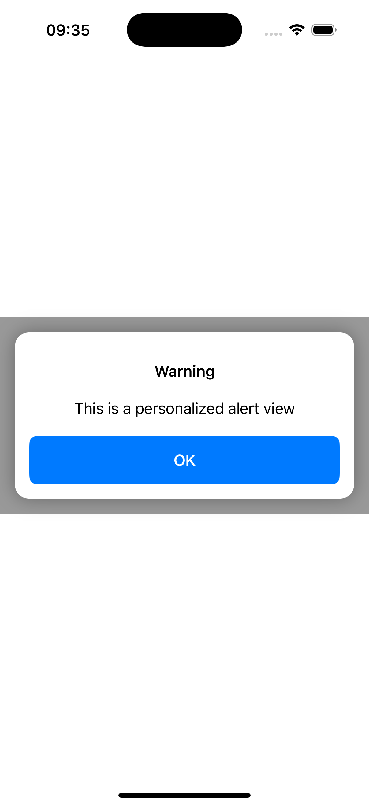

# AlertComponentConsumer
Sample iOS application that consumes a component as a SPM placed on GitHub. This is the basecode for following post [Maintain, Share, Repeat: iOS Component Distribution](https://javios.eu/swift/maintain-share-r…at-ios-component/)

## Appareance

